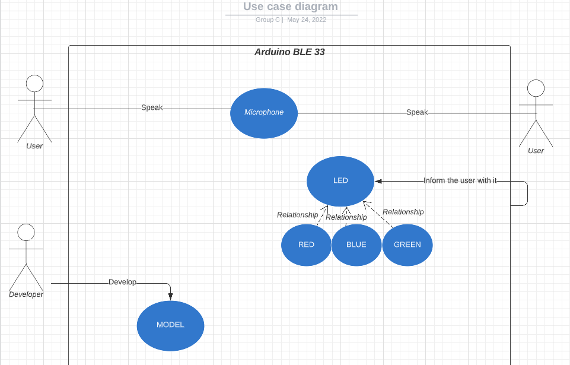

# Group C's Functional Specifications

---

Table of Contents

  
- [Group C's Functional Specifications](#group-cs-functional-specifications)
  - [Project scope](#project-scope)
  - [Goal](#goal)
  - [Features](#features)
  - [Deadlines](#deadlines)
  - [Risk and assumptions](#risk-and-assumptions)
  - [A) Voice quality](#a-voice-quality)
  - [B) Data privacy](#b-data-privacy)
  - [Product overview](#product-overview)
  - [Uses case](#uses-case)
  - [Requirements](#requirements)
  - [Configuration](#configuration)
  - [Non-functional requirements](#non-functional-requirements)

  
## Project scope

## Goal

The goal of the project is to create a device which will be able to listen to conversation and tell whether
the speakers are talking in English or in French. It will then, thanks to an indicator (a light for example),
display which language is being spoken.
In addition, this indicator should provide a degree of confidence
on the language spoken, either by displaying the percentage or by modifying the intensity of the display.

## Features

The project is developed in Python and C++ with arduino
This project is a device which will be able to listen to conversation and tell whether
the speakers are talking in English or in French.

## Deadlines

27,June 2022

## Risk and assumptions

## A) Voice quality

The product has to be able to collect a voice sample with enough quality and quantity. For that, we have to make sure the device understands well the words spoken by the user.

## B) Data privacy

We also need to take account that the conversation between the user and the product is listening is kept private, and that all its data aren’t recorded nor spied by someone else. Indeed, we want to make sure our program is just used for detecting language and nothing else.

## Product overview

For the project an AI will have to be used in order to recognize the language being spoken. The benefit
will be that the AI should be accurate thanks to the data provided for the training.

To get those data for the training we have a few options:
-Record samples ourselves during classes or with the help of volunteers.
This solution would be
more accurate since it would be the voice of the future users used to train. The downside would be that
it would be much longer to gather the data since it doesn’t already exist.

-Find existing samples. We can find some voice samples online that are available for download.
This solution would be faster to implement since the voice samples already exist and we wouldn’t have
to record them. The downside of this solution will be that the samples wouldn’t be as accurate in terms
of pronunciation and accent as if we recorded ourselves.

-Use data augmentation. Data augmentation is a process that allows to increase the amount of
data we have by modifying the data we already have. We would need to have some data before using
this but it could help a lot in creating sufficient data for the training of our AI

## Uses case

The developper have made the model of the AI. He put it on the Arduino Board.
The users speak next to the board equipped with a microphone and the Arduino board know if it's a english sentence or a french sentence with the model made by the developper and inform the users with the LED. Green for an english sentence or conversation , red for a french sentence or conversation and the LED blue for an unknow conversation(neither english nor french).

## Requirements

We have three basic filters the echo, the flange effect and the reverberation also we have a filter to modify the wave amplitude by a fixed amount. Firstly this modification you need to have a parameter for the amplitude.
To make the overdriven you need a loop for to make the effect on all of the sound.
An overdrive is the name given to an audio effect that aims to recreate the distortion of an electric guitar amplifier pushed to its gain limits. It usually has less gain than distortion.
An echo is when the sound was repeat less loud.
A flange is when the wave was repeat with a late of 20 milliseconds but this late was catch up and this effect was repeat during all of the sound.

In sound synthesis, an envelope is generated for each note, to describe the evolution of the volume within the note. Its shape has an important impact on the style of instrument being synthesised.A chord is a superposition of at least three different notes. Chords can be played by a polyphonic instrument, such as the piano, organ, guitar, etc., or by three monodic instruments

## Configuration

You need just the Arduino Board because you need the microphone on it with the AI train on it.
You also electricity to powered the arduino board.

## Non-functional requirements

If we have the time it possible to create a User Interface for the synthesizer that is possible to show immediately the waves and where it possible with some buttons to add an effect or change the wave with different parameters. Add a compatibility with android and IOS and a keyboard to play a sound or a music directly.
